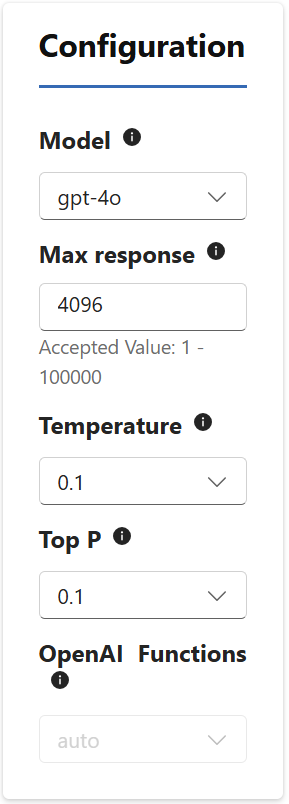
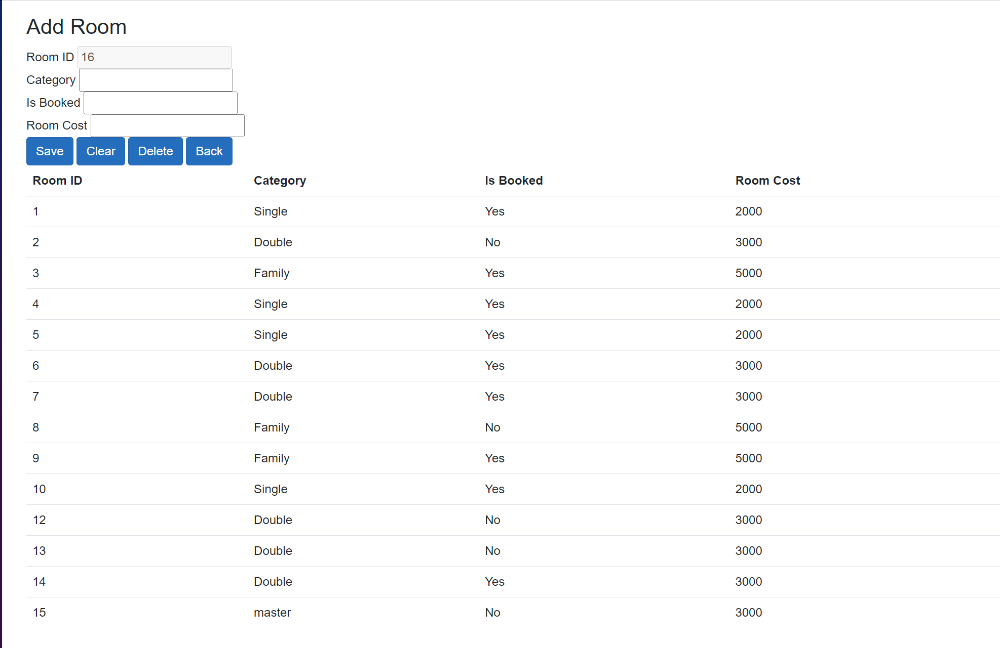

In this Hands on Lab you are going to migrate the existign windows Forms application into a Blazor application.

For each form we have in the exisitng forms application we are hoing to use chat GPT4-o large language model to help us with the conversion. For this you need to have access to the OpenAI playground.

We need to create a system prompt, to instruct the Large Language Model to help us with the conversion. Use the following prompt for the system prompt:

``` text
You are an AI programming assistant. Follow the user's requirements carefully and to the letter. First, think step-by-step and describe your plan for what to build in pseudocode, written out in great detail. Then, output the code in a single code block. Minimize any other prose. You specialize in converting Windows forms 4.8 files to Blazor .NET 8.0 pages with rendermode InteractiveServer. The data access code that is in the source files is kept the same and the data access class is injected using dependency injection.
Each user prompt contains the windows forms file to convert and the output is c# and .NET framework 8, no markdown and no explanation. 
You are only allowed to use standard controls and the blazor bootstrap controls.
```
When we are using the Large Language model we need to set a couple of parameters. You can find these parameters on the right hand side of the playground. Set the parameters as shown in the follwoing screenshot:

Select the `Model` to be gpt-4o, `Max Response` to 4096, `Temperature` to 0.1 and `Top P` also to 0.1

Setting the `Max response` higher than 4096 will result in an error, since the gpt-4o model can not do more tokens than this amount. By setting the `Temprature` to a low value, we limit the randomness of the response we will get. The same goes for the `Top P` parameter. We keep these values low, so we get somewhat predicatable outcomes. Feel free during the lab to experiment with various values.

## Converting AddRoom.cs
You select all the code that is in the file `AddRoom.cs` in the windows forms project.
Paste this code in the user prompt in the playground environment.  Hit enter, so you feed the request to the model and wait for the output response. The result of the response is what we are going to add to our newly creted Blazor project. We will add the generated pages as server side components in the components folder.

Copy the output and paste this in a new file with the name `addroom.razor` and place this in the components folder in the server project.

### Fixing up the generated code
The code that gets generated will contain some minor things that we still need to fix. First of all we need inject the `DataAccess` class, so all data access code that is in the code will be able to compile. Add to the top of the file the following statement: `@inject Project_HMS.DataAccess Da`
Next we need to add a reference `System.Data` so we can resolve types like `DataTable`and `DataSet` which are used in the data access code. This is by adding the `@using System.Data` directive to the page. 

### Making the UI look modern
Depending on how the model generated the code you will find that it created buttons using a css class. For each button ensure there is a `class='btn btn-primary'` stylesheet reference. This ensures the buttons are shown using the default blazor css markup that is available in the project. 

### Testing our first converted page
Compile the blazor project and the moment you see the home scren of the application, type on the url the name of the navigatable component you created. You can see how you can navigate to the page, by looking at the `@page <name of the page>` directive. Now on the URL add the `<name of the page>` at the end of the URL and see if you can view the page.

The result of the page should be something like the following:



When you double click one of the rowns in the table, you will see the text fields are filled and when you click the clear button the fields will be empty. The moment you double click a row of a room that has not been booked, you can click delete and it will be removed from the database. When you fill in the Category, Is Booked and Room Cost fields and add Save, the room will be added to the database.

## Converting BillHistory.cs
Here we take the exact same approach, we copy all the windows forms code we find in the `BillHistory.cs` file and we paste it in the user prompt in our AI Playground. Since we already set the parameters and the system prompt, the only thing we need to do is after pasting, hit enter and wait for the result.

Copy the results into a new file called BillHistry.razor and put it in the server project in the components folder.

We need to do the similar fixup of the code after generation. You add the `@inject Project_HMS.DataAccess Da` after the page directive, so we can use the data access class. Next we add the `@using System.Data` directive so we can use the types for data access. And you see if you can add some css classes to the generated buttons so they look nice.

### Testing Bill History.cs
Here you do the same, you compile the project, start it and then navigate to the page by adding the page name as stated in the `@page` directive.

## converting subsequent files
You do exactly the same steps for all subsequent forms you have in the `Project_HMS` project we provided. After generating the output, you create a corresponding razor page in the server project and you fx some minor things so the code compiles. After each page you test the page, so you end with all pages workking.

# :clock: If Time Permits:
