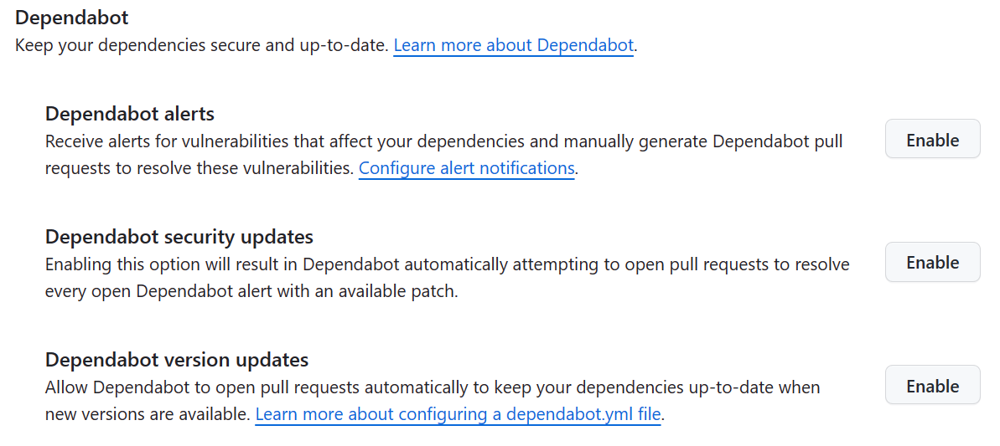

## Objective

This lab has the goal to teach you about supply chain management and in particular dependency management. You will learn about depency management in GitHub and about Dependabot. How to enable this and practice with  Dependabot's ability to update your dependencies automatically. First, you will enable the Dependency Management features, and then you will dive into Dependabot alerts, gaining insights into their crucial role in software security and updates. For those with extra time and dedication to thorough dependency management, there's an optional step about assigning Dependabot alerts to a person for review.

## Steps
### Step 1: :dependabot: Enabling the Dependency features
Let's start with enabling the Dependency Scanning features in your repository. These features are available in GitHub Advanced Security. This is a paid extension to GitHub but is also free for public repositories. 

- Navigate to the `Settings` tab on your repository
- Under the `Security` category in the menu, click `Code security and analysis features`.
- Click `Enable` for each of these features:
  * Dependency graph
  * Dependabot alerts
  * Dependabot security updates



Now you have enabled the Dependecy Management features.

### Step 2: :rotating_light: Dependabot alerts
Dependabot alerts tracks security vulnerabilities that apply to your repository’s dependencies. Dependebot proactively scans your repository manifes files for dependencies youcode has on other libraries. For example NuGet, NPM or Ruby packages. Becuase the security experts at GitHub continuously scan and update the vulnerabilities and put this in a database, Dependabot can recognize vulnerable packages and alert on this. It also adds Pull Requests for the found vulnerability with a proposed fix.


- Navigate to the `Security` tab on your repository, and click `Dependabot alerts`. Now you can see the active alerts generated by Dependabot.
- Click on an alert. You can see the details on that alert. Dependabot will show you details on the vulnerability and a suggested remediation. 
- Review the details of the vulnerability and, if available, the pull request containing the automated security update. 
- Optionally, if there isn't already a Dependabot security updates update for the alert, to create a pull request to resolve the vulnerability, click `Create Dependabot security update`.

### Step 3: :speech_balloon: View Pull Request
A pull request with regards to a security update will always be generated by the Dependabot bot user. Navigate to the pull request that was generated by the Dependabot bot user. 

- Navigate to the `Pull Request` Tab
- Open a Pull Request and view the suggested changes
- When you are happy with the changes and ready to update your dependency and resolve the vulnerability, merge the pull request. 
- Check out what you can do with Dependabot by opening the commands an options section in the PR. With some `@dependabot` commands you can quickly interact with the dependabot features.

## Recommended Bonus: :bulb: Always assign Dependabot alerts to a person for review
By default, Dependabot raises pull requests without any reviewers or assignees. Let's make use of the ability to configure Dependabot to always assign Dependabot alerts to a person. You can perform this kind of configuration using the `dependabot.yml` file. You must store this file in the `.github` directory of your repository. When you add or update the `dependabot.yml` file, this triggers an immediate check for version updates.

You can use reviewers and assignees to specify reviewers and assignees for all pull requests raised. You can also specify a team but when you specify a team, you must use the full team name, as if you were @mentioning the team (including the organization). 

The example `dependabot.yml` file below changes the npm configuration so that all pull requests opened with version and security updates for npm will have two reviewers and one assignee.
**@@TODO: Change to look at NuGet!**
```
# dependabot.yml file with
# reviews and an assignee for all npm pull requests

version: 2
updates:
  # Keep npm dependencies up to date
  - package-ecosystem: "npm"
    directory: "/"
    schedule:
      interval: "daily"
    # Raise all npm pull requests with reviewers
    reviewers:
      - "my-org/team-name"
      - "octocat"
    # Raise all npm pull requests with an assignee
    assignees:
      - "user-name"
```

- Create a file that always assigns Dependabot alerts to yourself using configuration via the `dependabot.yml` file.

For more information, please refer to:
- [https://docs.github.com/en/code-security/supply-chain-security/keeping-your-dependencies-updated-automatically/customizing-dependency-updates](https://docs.github.com/en/code-security/supply-chain-security/keeping-your-dependencies-updated-automatically/customizing-dependency-updates)
